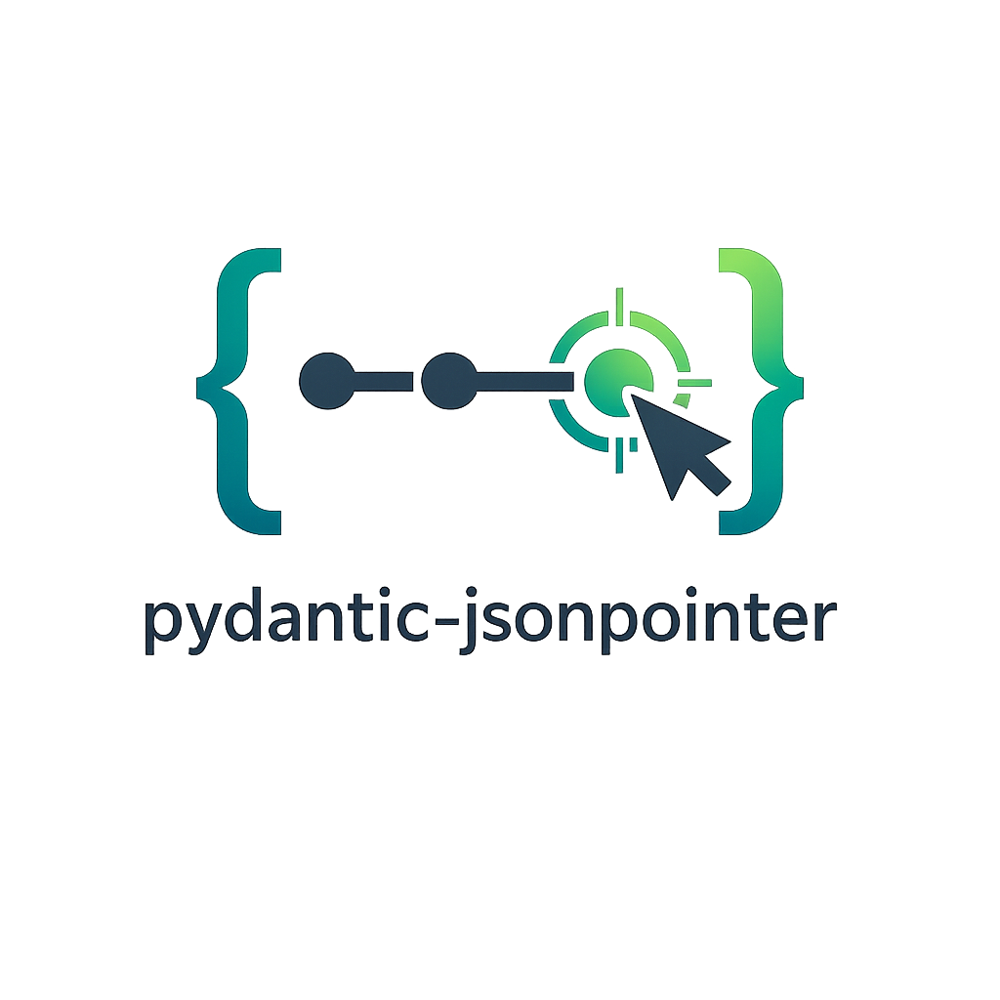

<p align="center">
  
</p>

# pydantic-jsonpointer

**JSONPointer ([RFC 6901](https://www.rfc-editor.org/rfc/rfc6901)) implementation for Pydantic 2.x.** A typed `JsonPointer` string for use in Pydantic models, plus a traversal API that walks `dict` / `list` / `pydantic.BaseModel` graphs through a pluggable adapter protocol.

[Get Started](getting-started/installation.md){ .md-button .md-button--primary }
[GitHub](https://github.com/codemageddon/pydantic-jsonpointer){ .md-button }

---

## Why pydantic-jsonpointer?

### Pydantic-native

`JsonPointer` is a `str` subclass with full Pydantic v2 integration — it serializes as a plain JSON string, validates RFC 6901 syntax on construction, and exposes the parsed token tuple as a property. Drop it straight into a model field:

```python
from pydantic import BaseModel
from pydantic_jsonpointer import JsonPointer


class Patch(BaseModel):
    path: JsonPointer
    value: object


Patch.model_validate({"path": "/items/0/name", "value": "x"})
```

### Alias-aware traversal

The built-in `BaseModelAdapter` traverses `BaseModel` instances through three swappable `FieldResolver` policies — by attribute, by serialization alias, or by validation alias (including `AliasChoices` and `AliasPath`) — so the same pointer works whether your wire format uses snake_case, camelCase, or anything in between.

### Pluggable adapters

The `ContainerAdapter` `Protocol` lets you teach the walker about any container type — frozen dataclasses, ORM rows, custom mappings — with eight methods. `dict`, `list`, and `pydantic.BaseModel` adapters ship pre-registered.

### Read / set / add / remove

```python
from pydantic_jsonpointer import JsonPointer as P, get_value, set_value, add_value, remove_value

doc = {"items": [{"name": "a"}, {"name": "b"}]}
get_value(doc, P("/items/1/name"))      # "b"
set_value(doc, P("/items/0/name"), "x") # in-place mutation
add_value(doc, P("/items/-"), {"name": "c"})  # append
remove_value(doc, P("/items/0"))
```

### Transitive freeze propagation

When a container or field is marked frozen (Pydantic `ConfigDict(frozen=True)`, `Field(frozen=True)`, or any third-party adapter that opts in), mutation through any descendant `Ptr` raises `ImmutableTargetError` *before* the underlying container is touched. The taint is propagated automatically at every step.

---

## Quick example

```python
from pydantic import BaseModel, Field
from pydantic_jsonpointer import JsonPointer, resolve


class Item(BaseModel):
    name: str = Field(serialization_alias="itemName")
    qty: int


class Order(BaseModel):
    items: list[Item]


order = Order(items=[Item(name="apple", qty=3)])
ptr = resolve(order, JsonPointer("/items/0/itemName"))
print(ptr.get())           # "apple"
ptr.set("banana")
print(order.items[0].name) # "banana"
```

---

## Next steps

- [Installation](getting-started/installation.md) — install with uv, pip, poetry, or pdm
- [Quickstart](getting-started/quickstart.md) — your first pointer, traversal, and mutation
- [Concepts](concepts/index.md) — the type system, traversal model, adapters, resolvers, and errors
